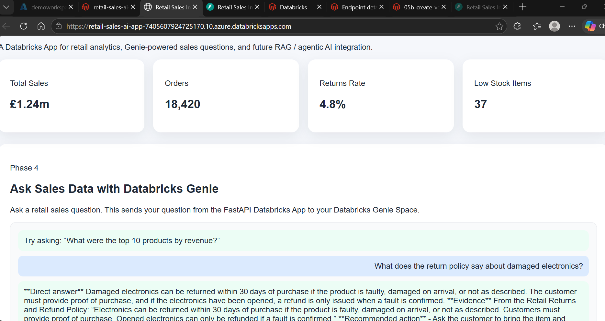
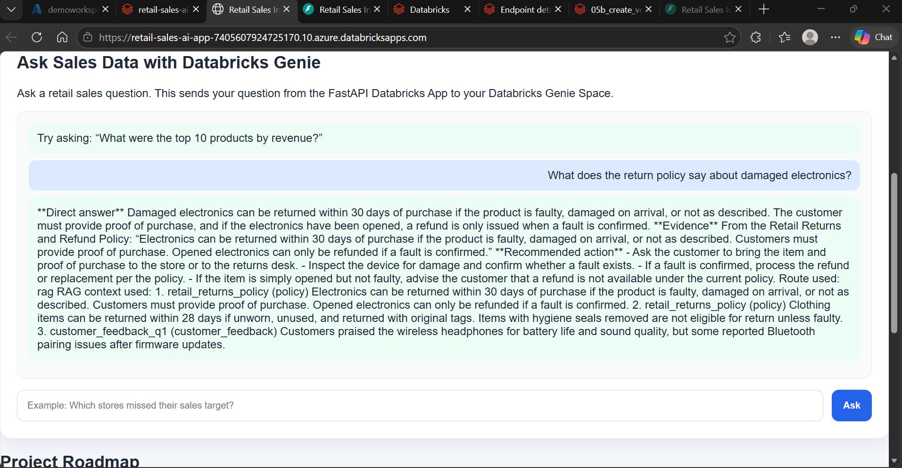
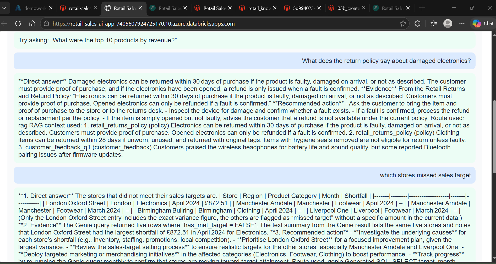
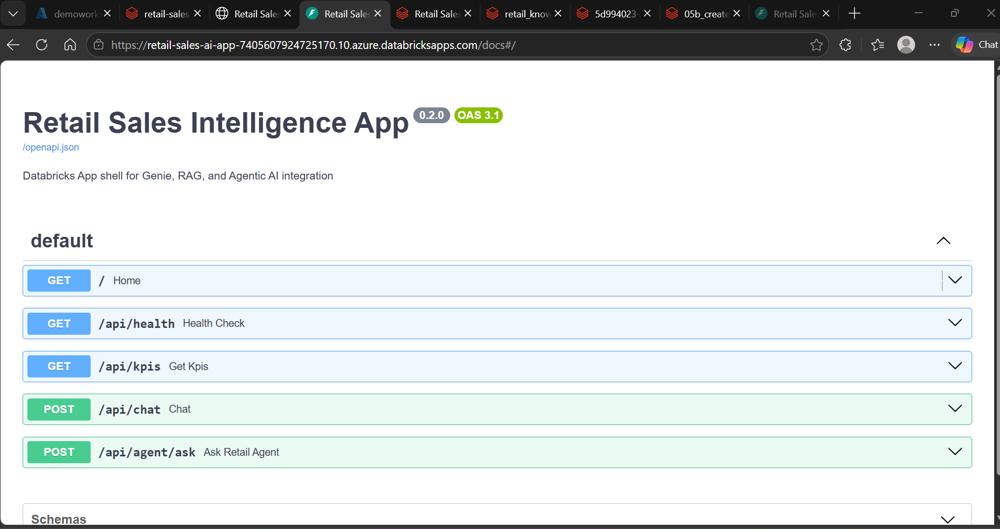
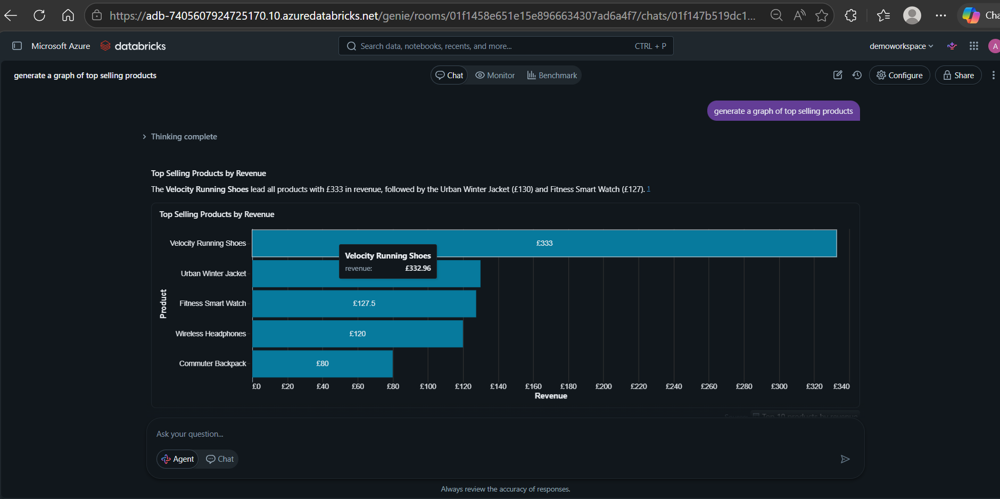
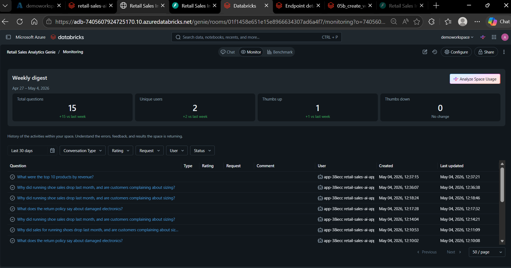
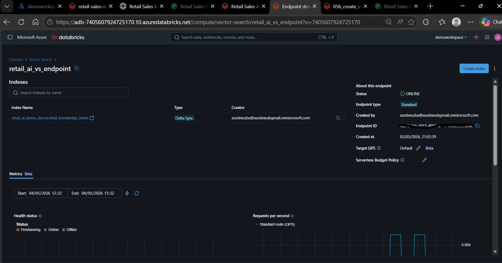
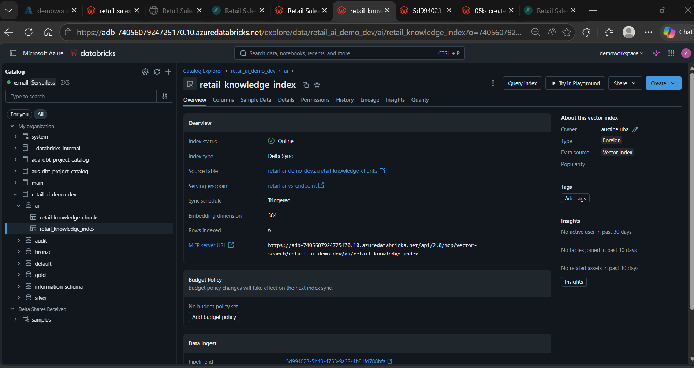

# Databricks Retail Sales AI App

## Overview

This project is a Databricks-native **Retail Sales Intelligence App** that brings together:

- Unity Catalog governed data
- Delta Lake medallion architecture
- Databricks AI/BI Genie for structured analytics
- Databricks Vector Search for Retrieval-Augmented Generation (RAG)
- Self-managed embeddings using `sentence-transformers`
- FastAPI deployed as a Databricks App
- An agentic orchestration layer that routes questions to Genie, RAG, or both

The purpose of the project is to demonstrate how a retail company can use Databricks to build an AI-powered business assistant that can answer both analytical questions and knowledge/document-based questions from a single user interface.

Example questions the app can support:

```text
What were the top 10 products by revenue?

What does the return policy say about damaged electronics?

Why did running shoe sales drop last month, and are customers complaining about sizing?
```

---

## Architecture

The final architecture is:

```text
User
  |
  v
Databricks App
  |
  v
FastAPI Backend
  |
  v
Retail AI Agent Router
  |
  |-- Structured analytics question
  |      -> Databricks Genie
  |
  |-- Policy / document / feedback question
  |      -> Vector Search RAG
  |
  |-- Mixed analytics + context question
  |      -> Genie + Vector Search RAG
  |
  v
Databricks Model Serving Endpoint
  |
  v
Final business-friendly answer
```

The design separates responsibilities clearly:

| Component | Purpose |
|---|---|
| Unity Catalog | Governance, permissions, and table management |
| Delta Lake | Storage layer for bronze, silver, gold, and AI tables |
| Gold tables/views | Structured retail analytics layer |
| Genie Space | Natural language to SQL over curated retail data |
| Vector Search | Retrieval over policy, product, feedback, and playbook text |
| FastAPI | Backend API for the Databricks App |
| Agent router | Decides whether to use Genie, RAG, or both |
| Model serving endpoint | Generates final business-friendly answer |

---

## Screenshots

### Deployed Databricks App







### Swagger API Documentation



### Databricks Genie





### Databricks Vector Search



### Self-Managed Vector Index



---

## Phases

### Phase 1: Retail Lakehouse Foundation

This phase creates the governed retail lakehouse foundation using a medallion architecture.

```text
Raw files
  -> Bronze
  -> Silver
  -> Gold
  -> Genie / Vector Search / Databricks App
```

The project uses a simple retail dataset with tables for:

- Customers
- Products
- Stores
- Sales
- Inventory
- Returns
- Promotions
- Sales targets
- Retail knowledge chunks

Key gold tables include:

```text
retail_ai_demo_dev.gold.fact_sales
retail_ai_demo_dev.gold.dim_product
retail_ai_demo_dev.gold.dim_store
retail_ai_demo_dev.gold.dim_customer
retail_ai_demo_dev.gold.fact_inventory
retail_ai_demo_dev.gold.fact_returns
retail_ai_demo_dev.gold.sales_targets
```

The goal of Phase 1 is to create a reliable structured analytics layer that later powers Genie and the app.

---

### Phase 2: FastAPI App Shell

This phase creates the initial FastAPI application shell.

The first version of the app includes:

- A landing page
- Mock KPI cards
- Static HTML/CSS/JavaScript
- Basic API endpoints
- Local testing using Uvicorn

Example local run command:

```bash
python -m uvicorn app:app --reload --host 127.0.0.1 --port 8000
```

Local test URLs:

```text
http://127.0.0.1:8000
http://127.0.0.1:8000/docs
```

---

### Phase 3: Databricks App Deployment

This phase deploys the FastAPI application as a Databricks App.

The app is configured using `app.yaml` and deployed into the Databricks workspace.

The Databricks App gives the project a user-facing interface where business users can ask retail analytics and knowledge questions.

---

### Phase 4: Genie Integration

This phase integrates Databricks AI/BI Genie.

Genie is used for structured analytics questions over curated retail tables and views.

Example Genie questions:

```text
What were the top 10 products by revenue?

Which stores missed their sales target?

Which product categories had the highest return rate?

Show sales trend by week.
```

The app originally exposed a Genie-only endpoint:

```text
POST /api/chat
```

This endpoint is still available for direct Genie testing, but the main app flow now uses the Phase 6 agent endpoint.

---

### Phase 5: Vector Search RAG

This phase creates the Retrieval-Augmented Generation capability.

The project creates a retail knowledge base from text-based content such as:

- Return and refund policies
- Product guidance
- Customer feedback
- Promotion rules
- Store operating notes
- Sales playbook guidance

The knowledge chunks are stored in:

```text
retail_ai_demo_dev.ai.retail_knowledge_chunks
```

The Vector Search index is:

```text
retail_ai_demo_dev.ai.retail_knowledge_index
```

The Vector Search endpoint is:

```text
retail_ai_vs_endpoint
```

---

### Phase 6: Agentic Orchestration

This phase builds the agentic process.

The app now exposes:

```text
POST /api/agent/ask
```

This endpoint sends the user question to the Retail AI Agent.

The agent decides whether the question should go to:

```text
Genie only
RAG only
Both Genie and RAG
```

Example routing:

| User question | Route |
|---|---|
| What were the top 10 products by revenue? | Genie |
| What does the return policy say about damaged electronics? | RAG |
| Why did running shoe sales drop last month, and are customers complaining about sizing? | Both |

---

## How RAG Works

RAG means **Retrieval-Augmented Generation**.

In this project, the RAG flow works like this:

```text
User question
  |
  v
Generate question embedding
  |
  v
Query Databricks Vector Search using query_vector
  |
  v
Retrieve relevant knowledge chunks
  |
  v
Send question + retrieved chunks to LLM
  |
  v
Generate grounded answer
```

The important project details are:

| Item | Value |
|---|---|
| Knowledge table | `retail_ai_demo_dev.ai.retail_knowledge_chunks` |
| Vector Search index | `retail_ai_demo_dev.ai.retail_knowledge_index` |
| Embedding column | `chunk_vector` |
| Embedding model | `sentence-transformers/all-MiniLM-L6-v2` |
| Vector dimension | `384` |
| Query method | `query_vector` |

---

## Self-Managed Embeddings

This project uses **self-managed embeddings**.

A Databricks-managed embedding endpoint was not available in the workspace at the time of implementation, so the embeddings were generated manually using `sentence-transformers`.

The Phase 5 notebook used:

```python
from sentence_transformers import SentenceTransformer

model = SentenceTransformer("sentence-transformers/all-MiniLM-L6-v2")

vectors = model.encode(
    texts,
    normalize_embeddings=True
)
```

The generated embeddings were stored in the Delta table column:

```text
chunk_vector
```

The Vector Search index was created using:

```python
embedding_dimension=384
embedding_vector_column="chunk_vector"
```

Because the index uses self-managed embeddings, the app cannot query the index using only:

```python
query_text=question
```

Instead, the app must generate the user question embedding and query the index using:

```python
query_vector=question_vector
```

This was one of the key lessons from the project.

---

## How the Agent Works

The current agent is a single-agent orchestrator.

It uses deterministic routing logic to classify the question.

### Genie route

Used for structured analytics questions.

Examples:

```text
What were the top 10 products by revenue?
Which stores missed their sales target?
Which products had the highest sales last month?
What was the return rate by category?
```

### RAG route

Used for policy, product knowledge, playbook, and customer feedback questions.

Examples:

```text
What does the return policy say about damaged electronics?
What are customers saying about sizing?
What does the sales playbook say about upselling?
What guidance exists for handling product complaints?
```

### Both route

Used for mixed questions that require both structured data and unstructured context.

Examples:

```text
Why did running shoe sales drop last month, and are customers complaining about sizing?

Which products are trending down, and what customer feedback explains the drop?
```

The final answer is generated by passing the tool outputs to a Databricks model serving endpoint.

---

## API Endpoints

The deployed FastAPI app exposes the following endpoints.

### `GET /`

Renders the retail app landing page.

---

### `GET /api/health`

Returns app health and configuration status.

Example response:

```json
{
  "status": "ok",
  "app": "Retail Sales Intelligence App",
  "phase": "Phase 6 - Agentic Process with Genie and Vector Search RAG",
  "genie_space_configured": true,
  "vector_search_index_configured": true,
  "llm_endpoint_configured": true,
  "embedding_model_configured": true
}
```

---

### `GET /api/kpis`

Returns mocked KPI values for the landing page.

Example response:

```json
{
  "total_sales": "£1.24m",
  "orders": "18,420",
  "returns_rate": "4.8%",
  "low_stock_items": 37
}
```

---

### `POST /api/chat`

Legacy Phase 4 endpoint.

This sends the question directly to Databricks Genie.

Example request:

```json
{
  "question": "What were the top 10 products by revenue?"
}
```

---

### `POST /api/agent/ask`

Main Phase 6 endpoint.

This sends the question to the Retail AI Agent.

Example request:

```json
{
  "question": "What does the return policy say about damaged electronics?"
}
```

Example response shape:

```json
{
  "question": "What does the return policy say about damaged electronics?",
  "route": "rag",
  "answer": "...",
  "genie_result": null,
  "rag_context": [],
  "tool_trace": []
}
```

---

## Deployment Notes

The Databricks App uses `app.yaml`.

Example configuration:

```yaml
command:
  - uvicorn
  - app:app
  - --host
  - 0.0.0.0
  - --port
  - "$DATABRICKS_APP_PORT"

env:
  - name: GENIE_SPACE_ID
    valueFrom: genie-space

  - name: VECTOR_SEARCH_INDEX_NAME
    valueFrom: vector-search-index

  - name: EMBEDDING_MODEL_NAME
    value: sentence-transformers/all-MiniLM-L6-v2

  - name: LLM_ENDPOINT_NAME
    value: databricks-gpt-oss-20b
```

The app requires the following Databricks resources:

- Databricks App
- Genie Space resource
- Vector Search index resource
- Model serving endpoint
- Unity Catalog permissions for the app service principal

---

## Requirements

The app requires the following Python packages:

```text
fastapi
uvicorn
jinja2
databricks-sdk
databricks-vectorsearch
pydantic
python-multipart
sentence-transformers
```

---

## Lessons Learned

### 1. Genie and RAG solve different problems

Genie is strong for structured analytics questions.

Vector Search RAG is better for policy, product knowledge, playbook guidance, and customer feedback.

The agentic layer becomes valuable because it decides which capability to use for each question.

---

### 2. Self-managed embeddings require query vectors

Because the Vector Search index was created using an existing `chunk_vector` column, the app must generate the user question embedding itself.

This means the app queries Vector Search using:

```python
query_vector=question_vector
```

not:

```python
query_text=question
```

---

### 3. The embedding model must match

The same model used to embed the documents must be used to embed the user question.

This project uses:

```text
sentence-transformers/all-MiniLM-L6-v2
```

which creates 384-dimensional vectors.

---

### 4. Databricks App resource permissions matter

The Databricks App service principal needs access to:

- Genie Space
- Vector Search index
- Model serving endpoint
- Unity Catalog catalog/schema/table objects

Without these permissions, the app may start successfully but fail when calling Genie, Vector Search, or model serving.

---

### 5. LLM response formats can vary

Some model serving endpoints return response content as a string.

Others return response content as a list of content blocks.

The app normalises the model response into a plain string before returning it to the frontend.

---

## Future Improvements

Potential improvements include:

- Replace keyword-based routing with LLM-based tool selection
- Add MLflow tracing for agent calls
- Add evaluation sets for Genie, RAG, and mixed questions
- Add source citations in the frontend UI
- Add conversation history
- Add persistent chat sessions
- Improve frontend styling
- Add role-based access control for different user groups
- Add richer KPI cards from live gold tables
- Add charts and tables for Genie query results
- Upgrade to a Databricks-managed embedding endpoint when available
- Explore Mosaic AI Agent Framework or MCP-based tool orchestration

---

## Project Status

Current status:

```text
Databricks App: Working
Genie integration: Working
Vector Search index: Working
Self-managed embedding RAG: Working
Agentic routing: Working
Frontend integration: Working
Swagger API docs: Working
```

This project demonstrates an end-to-end Databricks-native AI application pattern for combining structured analytics, retrieval-augmented generation, and agentic orchestration in a single deployed app.
